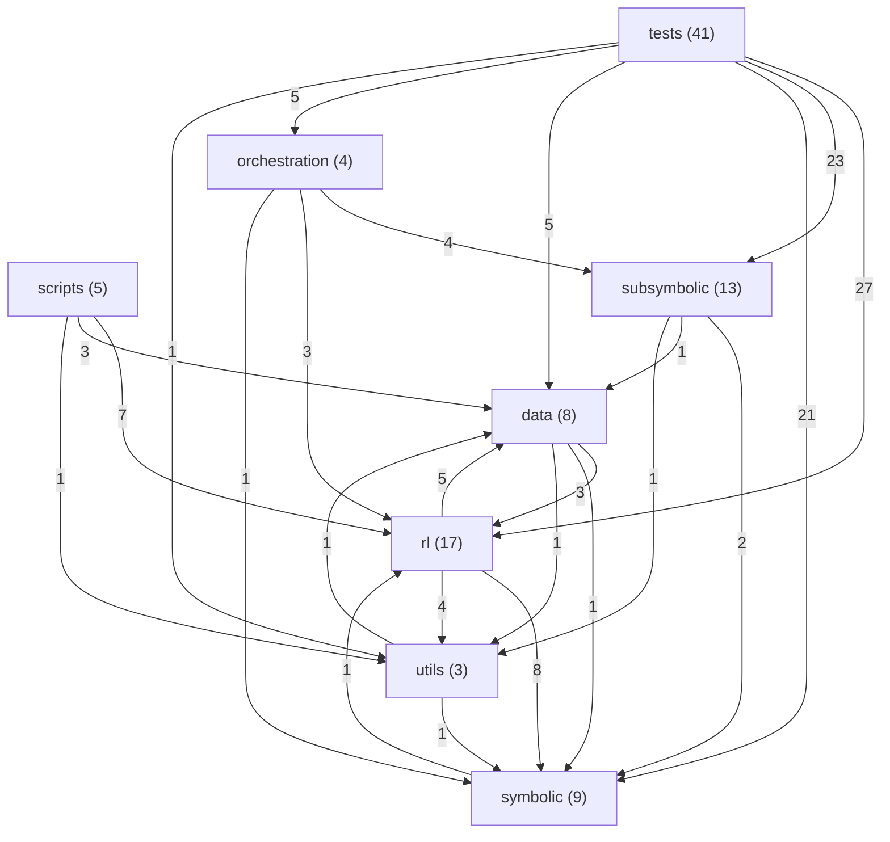

# Architecture

One ARC-AGI task, three ways of attacking it, and the plumbing that lets
them be compared: a **symbolic** layer that describes what a task does, an
**rl** layer that searches for a sequence of grid transforms that does it,
and a **subsymbolic** layer that asks a language model. `orchestration`
picks between them; `scripts` measures them.

Read this file for the shape of the thing. It is written by hand above the
generated marker and generated below it - what a package is *for* is
nobody's inference, what depends on what is nobody's memory.

    python scripts/module_map.py --check    # fails when the map is stale
    python scripts/module_map.py --write    # regenerates it
    lint-imports                            # fails when a layer is crossed

## The layering

Read downwards; a module may import anything below it and nothing above.
The contract is in `pyproject.toml` under `[tool.importlinter]`, so this is
checked, not claimed.

    scripts | orchestration
    rl | subsymbolic
    utils.plotting
    data.datasets
    symbolic
    data.configs | utils.utils

`data` is split because its halves sit at opposite ends: `configs` are
leaves everything reads, `datasets` is a loader that legitimately needs the
analysis layer. `rl` and `subsymbolic` are held independent of each other -
they are alternative answers to the same question, joined by
`orchestration`, and an import either way would make one unrunnable without
the other's dependencies (`rl` alone pulls torch, stable-baselines3 and
gymnasium).

Four imports are exempted in the contract, listed there with the reason.
Two of them are the same cause: `rl/arc_task.py` holds the task container
with the highest fan-in in the repository (15) and is not an RL module.
Moving it below the layers would close both, and would also remove the two
indirect chains by which `subsymbolic` currently reaches `rl` without ever
mentioning it.

## Where to look

| you want | start at |
| --- | --- |
| run the whole pipeline on one task | `orchestration/__main__.py`, `orchestration/graph.py` |
| how a grid becomes objects | `symbolic/objects_analysis.py` (`GridObject`, the component retrieval) |
| what the analyser claims about a task | `symbolic/findings.py`, then `symbolic/summaries.py` |
| the action vocabulary | `data/configs/env_configs.py`, expanded by `rl/utils.py:define_feasible_actions` |
| what an action does to a grid | `rl/arc_world.py:apply_transform`, dispatching into `rl/arc_transformators.py` |
| the environment an agent or a search sees | `rl/arc_env.py` (`ARCGridWorld`) |
| the search | `rl/mcts.py` |
| PPO training | `rl/training.py`, `rl/policy.py`, launched by `rl/rl_job.py` |
| how a prompt is assembled | `subsymbolic/prompt_builder.py`, blocks in `data/prompts`, resolvers in `subsymbolic/registry.py` |
| running a model over many tasks | `subsymbolic/llm_run.py`, backend in `subsymbolic/llm_setup.py` and `llm_runtime.py` |
| comparing two prompt arms | `scripts/compare_llm_arms.py` |
| measuring the search over the dataset | `scripts/compare_reward_approaches.py`, then `scripts/harvest_traces.py` |

## The packages

**`symbolic`** turns a task into statements about it. `objects_analysis`
finds objects and their properties, `summaries` and `patterns` compare
input against output across examples, `findings` is the typed result -
the contract everything downstream reads - and `symbolic_module` wraps the
solvers that answer some tasks outright. It is the only layer that claims
to *understand* a task, and the only one whose output a human can check by
reading it.

**`rl`** is the grid as a state machine. `arc_task` carries a task,
`arc_world` applies one transform to one or two objects,
`arc_transformators` holds the transforms themselves, `arc_env` wraps it
as a Gymnasium env, and `mcts` searches it. `features` and `policy` are
the learned side; `training`, `callbacks` and `evaluation` are the loop
around it.

**`subsymbolic`** is everything about talking to a language model.
`prompt_builder` composes blocks under a token budget, `arc_resolvers`
supplies the blocks that need computing rather than templating,
`llm_setup` gets a backend into memory, `llm_runtime` generates, and
`llm_run` walks a dataset with checkpointing and wandb logging.
`analyst` is the piece that reads symbolic findings and picks agents.

**`orchestration`** is the multi-agent skeleton (LangGraph) that routes a
task between those three, plus the system-level config.

**`data`** is configuration and datasets: the action vocabulary and agent
rosters in `configs`, ARC itself in `datasets/ARC`, prompt templates in
`prompts`.

**`scripts`** are the measurement tools. They are not part of any run -
each exists because a question came up that the code could not answer by
being read.

**`utils`** is plotting and small shared helpers.

## Things that bite

- **An action is three numbers**, not one: `(transform, object_1, object_2)`
  over `MAX_OBJECTS = 16` slots. A slot beyond the objects a grid actually
  has is a legal action that does nothing, and there are many of them.
- **Colours and directions are baked into action names.** `red_recolor` is
  "recolor to colour 2"; the vocabulary is generated per colour and per
  direction, so its size depends on which colours you build it with -
  89 names at two colours and two directions, 141 at three, 2943 at all
  ten and all eight.
- **`max_int` counts `2 * matches - valid`**, so fixing one cell moves it
  by two. Gains read off it are in those units, not in cells.
- **A transform that cannot apply returns the grid untouched.** It never
  half-applies and never raises, which is why "nothing happened" and "this
  was refused" look identical from outside.
- **`repr_level` decides what an object is**: level 1 is colour-agnostic
  connected components, level 2 is per colour. Relations that hold at one
  level are absent at the other - `touches` never fires at level 1.
- **Prompt `blocks` and `resolvers` are separate lists.** A block whose
  name matches a resolver is computed; otherwise a template of that name is
  rendered. `overrides` wins over both.
- **Search shards are only poolable within one vocabulary.** Action 47 is a
  name, not a number.

<!-- generated by scripts/module_map.py - do not edit below -->

| module | kB | imported by |
| --- | ---: | ---: |
| `data.configs.agents_config` | 6 | 2 |
| `data.configs.env_configs` | 4 | 6 |
| `data.configs.rl_configs` | 1 | 4 |
| `data.datasets.ARC.arc_dataset` | 12 | 3 |
| `orchestration.__main__` | 2 | 0 |
| `orchestration.configs` | 5 | 5 |
| `orchestration.graph` | 22 | 2 |
| `rl.arc_env` | 26 | 7 |
| `rl.arc_hp_search` | 4 | 1 |
| `rl.arc_task` | 1 | 15 |
| `rl.arc_transformators` | 71 | 4 |
| `rl.arc_world` | 16 | 3 |
| `rl.callbacks` | 7 | 1 |
| `rl.evaluation` | 3 | 2 |
| `rl.features` | 28 | 2 |
| `rl.mcts` | 47 | 3 |
| `rl.optimization` | 4 | 2 |
| `rl.plotting` | 8 | 1 |
| `rl.policy` | 9 | 2 |
| `rl.rl_job` | 4 | 1 |
| `rl.rl_module` | 2 | 2 |
| `rl.training` | 11 | 4 |
| `rl.utils` | 9 | 6 |
| `scripts.compare_llm_arms` | 36 | 0 |
| `scripts.compare_reward_approaches` | 26 | 1 |
| `scripts.harvest_traces` | 23 | 0 |
| `scripts.module_map` | 6 | 0 |
| `scripts.sync_llm_kit` | 2 | 0 |
| `subsymbolic.analyst` | 9 | 1 |
| `subsymbolic.arc_evaluators` | 2 | 1 |
| `subsymbolic.arc_grid_formatting` | 2 | 2 |
| `subsymbolic.arc_resolvers` | 4 | 2 |
| `subsymbolic.llm_run` | 16 | 3 |
| `subsymbolic.llm_runtime` | 21 | 5 |
| `subsymbolic.llm_setup` | 22 | 5 |
| `subsymbolic.logging` | 2 | 1 |
| `subsymbolic.prompt_builder` | 12 | 9 |
| `subsymbolic.registry` | 0 | 3 |
| `subsymbolic.subsymbolic_module` | 2 | 2 |
| `subsymbolic.utils` | 7 | 3 |
| `symbolic.analyzer` | 44 | 3 |
| `symbolic.color_names` | 0 | 1 |
| `symbolic.findings` | 29 | 4 |
| `symbolic.objects_analysis` | 51 | 14 |
| `symbolic.patterns` | 28 | 4 |
| `symbolic.summaries` | 79 | 8 |
| `symbolic.symbolic_module` | 55 | 2 |
| `symbolic.utils` | 12 | 10 |
| `utils.plotting` | 19 | 6 |
| `utils.utils` | 2 | 2 |

Packages that import each other:

- `data` -> `rl` (3) against `rl` -> `data` (5):
  - `data.configs.rl_configs imports rl.policy`
  - `data.configs.rl_configs imports rl.utils`
  - `data.datasets.ARC.arc_dataset imports rl.arc_task`
- `symbolic` -> `rl` (1) against `rl` -> `symbolic` (8):
  - `symbolic.summaries imports rl.arc_task`
- `data` -> `utils` (1) against `utils` -> `data` (1):
  - `data.datasets.ARC.arc_dataset imports utils.utils`

<!-- end generated -->
