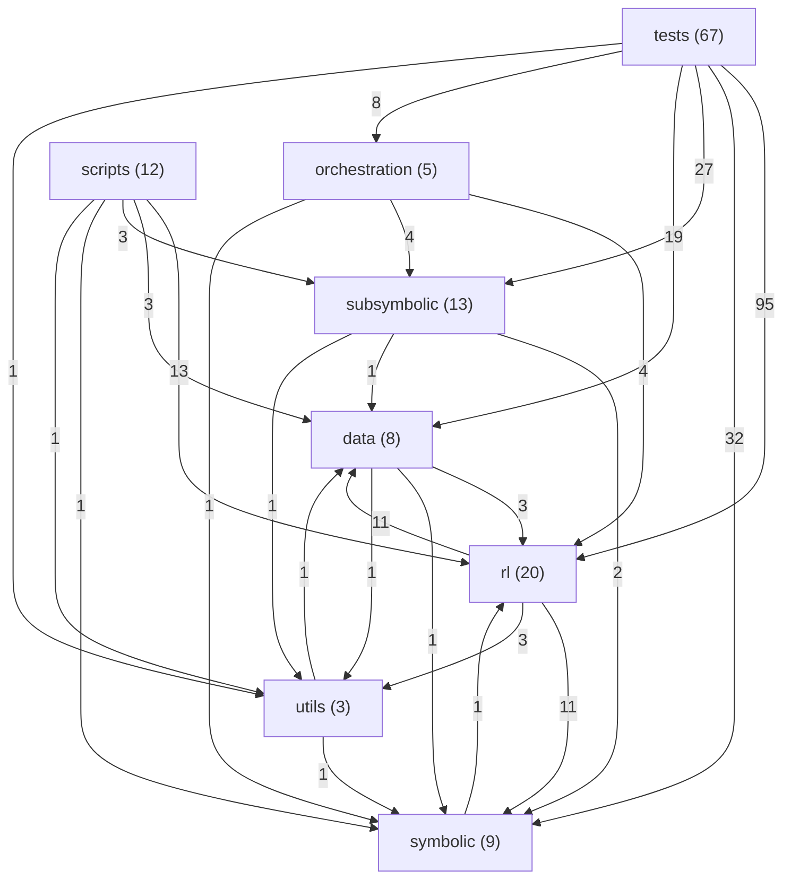

# Architecture

One ARC-AGI task, three ways of attacking it, and the plumbing that lets
them be compared: a **symbolic** layer that describes what a task does, an
**rl** layer that searches for a sequence of grid transforms that does it,
and a **subsymbolic** layer that asks a language model. `orchestration`
picks between them; `scripts` measures them.

Read this file for the shape of the thing. It is written by hand above the
generated marker and generated below it - what a package is *for* is
nobody's inference, what depends on what is nobody's memory.

    python scripts/module_map.py --check    # fails when the map is stale
    python scripts/module_map.py --write    # regenerates it
    lint-imports                            # fails when a layer is crossed

## The layering

Read downwards; a module may import anything below it and nothing above.
The contract is in `pyproject.toml` under `[tool.importlinter]`, so this is
checked, not claimed.

    scripts | orchestration
    rl | subsymbolic
    utils.plotting
    data.datasets
    symbolic
    data.configs | utils.utils

`data` is split because its halves sit at opposite ends: `configs` are
leaves everything reads, `datasets` is a loader that legitimately needs the
analysis layer. `rl` and `subsymbolic` are held independent of each other -
they are alternative answers to the same question, joined by
`orchestration`, and an import either way would make one unrunnable without
the other's dependencies (`rl` alone pulls torch, stable-baselines3 and
gymnasium).

Four imports are exempted in the contract, listed there with the reason.
Two of them are `rl/arc_task.py`, the task container with the highest fan-in
in the repository (15), which is not an RL module - and those two are
cosmetic. Importing it pulls in `rl` and `rl.arc_task` and nothing else: no
torch, no gymnasium. So the two indirect chains by which `subsymbolic`
reaches `rl` cost nothing at runtime, and moving the file would tidy the
graph, break every notebook that imports it from its current home, and buy
nothing.

## Where to look

| you want | start at |
| --- | --- |
| run the whole pipeline on one task | `orchestration/__main__.py`, `orchestration/graph.py` |
| how a grid becomes objects | `symbolic/objects_analysis.py` (`GridObject`, the component retrieval) |
| what the analyser claims about a task | `symbolic/findings.py`, then `symbolic/summaries.py` |
| the action vocabulary | `data/configs/env_configs.py`, expanded by `rl/utils.py:define_feasible_actions` and `rl/search_hints.py:build_vocabulary` |
| what an action does to a grid | `rl/arc_world.py:apply_transform`, dispatching into `rl/arc_transformators.py` |
| the environment an agent or a search sees | `rl/arc_env.py` (`ARCGridWorld`): grid, deltas, object and relation embeddings |
| the search over object actions | `rl/mcts.py`; `rl/search_hints.py` runs it per task (base action types first, then the agent rosters) |
| the search over strokes, for coordinate-addressed tasks | `rl/coordinate_search.py` |
| what a verified search finding says to an LLM | `rl/search_hints.py:hints_for`, joined to a prompt by `orchestration/context.py:with_search_hints` through the build context, and shown by the `search_hints` block (`subsymbolic/arc_resolvers.py`) |
| what the agent's action is made of | `rl/action_structure.py` (type, colour, direction as separate choices) |
| how observations become features | `rl/features.py` (`ARCCombinedExtractor`), read by the heads in `rl/policy.py` |
| PPO training | `rl/training.py`, `rl/policy.py`, launched by `rl/rl_job.py`, which narrows the vocabulary per task |
| how a prompt is assembled | `subsymbolic/prompt_builder.py`, blocks in `data/prompts`, resolvers in `subsymbolic/registry.py` |
| running a model over many tasks | `subsymbolic/llm_run.py`, backend in `subsymbolic/llm_setup.py` and `llm_runtime.py` |
| comparing two prompt arms | `scripts/compare_llm_arms.py` |
| which tasks each way of solving solves, and what they add to one another | `scripts/solved_by_source.py`, reading the files the measuring scripts write |
| measuring the search over the dataset | `scripts/compare_reward_approaches.py`, `scripts/search_budget.py`, then `scripts/harvest_traces.py` |

## The packages

**`symbolic`** turns a task into statements about it. `objects_analysis`
finds objects and their properties, `summaries` and `patterns` compare
input against output across examples, `findings` is the typed result -
the contract everything downstream reads - and `symbolic_module` wraps the
solvers that answer some tasks outright. It is the only layer that claims
to *understand* a task, and the only one whose output a human can check by
reading it.

**`rl`** is the grid as a state machine. `arc_task` carries a task,
`arc_world` applies one transform to one or two objects (or, under
coordinate addressing, to two cells), `arc_transformators` holds the
transforms themselves, `arc_env` wraps it as a Gymnasium env, and `mcts`
searches it. Two things sit between the search and the learner:
`search_hints` runs the search for a task - the base action types first,
then the agent rosters - and keeps what reproduces every training pair,
and `rl_job` uses what it found to narrow the action vocabulary before
PPO starts. `features` and `policy` are the learned side (objects,
relations and the two deltas in; pointer heads over objects, or over rows
and columns, out); `training`, `callbacks` and `evaluation` are the loop
around it.

**`subsymbolic`** is everything about talking to a language model.
`prompt_builder` composes blocks under a token budget, `arc_resolvers`
supplies the blocks that need computing rather than templating,
`llm_setup` gets a backend into memory, `llm_runtime` generates, and
`llm_run` walks a dataset with checkpointing and wandb logging.
`analyst` is the piece that reads symbolic findings and picks agents.

**`orchestration`** is the multi-agent skeleton (LangGraph) that routes a
task between those three, plus the system-level config.

**`data`** is configuration and datasets: the action vocabulary and agent
rosters in `configs`, ARC itself in `datasets/ARC`, prompt templates in
`prompts`. Beside the task files, `datasets/ARC/idx2agent.pkl` labels each
task with the agent that suits it, and `evaluation_difficulty.json` grades
the 400 evaluation tasks by hand (easy, medium, hard, very_hard,
impossible; the 27 the symbolic modules solve are `symbolic`, and were never
shown to an LLM; three that they do not solve, put there at first, are
graded `medium` and left to the LLM). `task2difficulty.json` is not that
grade - it says 'easy' for every training task and 'hard' for every
evaluation one.

**`scripts`** are the measurement tools (`compare_llm_arms`,
`compare_reward_approaches`, `search_budget`, `harvest_traces`,
`symbolic_coverage`, `solved_by_source`, `prompt_variants`, plus
`module_map` and `sync_llm_kit`). They are not part of any run -
each exists because a question came up that the code could not answer by
being read.

**`utils`** is plotting and small shared helpers.

## Things that bite

- **An action is several numbers**, not one. Object addressing is
  `(transform, object_1, object_2)` over object slots; coordinate addressing
  is `(transform, i1, j1, i2, j2)` over the rows and columns of the grid.
  The slots are the objects the task's grids fill when the job narrows them
  to the task (a median of 3), and `MAX_OBJECTS = 16` when nothing does. A
  slot beyond the objects a grid actually has is a legal action that does
  nothing.
- **Colours and directions are baked into action names.** `red_recolor` is
  "recolor to colour 2"; the vocabulary is generated per colour and per
  direction, so its size depends on which colours you build it with -
  89 names at two colours and two directions, 145 at three colours, 1669
  at ten colours and the four main directions, 3037 at all ten and all
  eight. The search narrows it per task before anything learns over it.
- **`max_int` counts `2 * matches - valid`**, so fixing one cell moves it
  by two. Gains read off it are in those units, not in cells.
- **A transform that cannot apply returns the grid untouched.** It never
  half-applies and never raises, which is why "nothing happened" and "this
  was refused" look identical from outside.
- **`repr_level` decides what an object is**: level 1 is colour-agnostic
  connected components, level 2 is per colour. Relations that hold at one
  level are absent at the other - `touches` never fires at level 1.
- **Prompt `blocks` and `resolvers` are separate lists.** A block whose
  name matches a resolver is computed; otherwise a template of that name is
  rendered. `overrides` wins over both.
- **Search shards are only poolable within one vocabulary.** Action 47 is a
  name, not a number.
- **A hint is said only when it is verified.** `hints_for` reproduces every
  training pair with the same kinds of step, or says nothing; the summary
  the LLM reads (`symbolic/findings.py`) states a fact only when it holds
  in every example. Both are computed for the task in hand, not read from a
  file.
- **Observation padding is not grid padding.** When a task's examples
  differ in size the observation is padded to the largest and carries
  `grid_shape`, and the extractor crops it back; the env's own grid is never
  padded.

<!-- generated by scripts/module_map.py - do not edit below -->

```mermaid
graph TD
  data["data (8)"]
  orchestration["orchestration (5)"]
  rl["rl (20)"]
  scripts["scripts (12)"]
  subsymbolic["subsymbolic (13)"]
  symbolic["symbolic (9)"]
  tests["tests (67)"]
  utils["utils (3)"]
  tests -->|95| rl
  tests -->|32| symbolic
  tests -->|27| subsymbolic
  tests -->|19| data
  scripts -->|13| rl
  rl -->|11| data
  rl -->|11| symbolic
  tests -->|8| orchestration
  orchestration -->|4| rl
  orchestration -->|4| subsymbolic
  data -->|3| rl
  rl -->|3| utils
  scripts -->|3| data
  scripts -->|3| subsymbolic
  subsymbolic -->|2| symbolic
  data -->|1| symbolic
  data -->|1| utils
  orchestration -->|1| symbolic
  scripts -->|1| symbolic
  scripts -->|1| utils
  subsymbolic -->|1| data
  subsymbolic -->|1| utils
  symbolic -->|1| rl
  tests -->|1| utils
  utils -->|1| data
  utils -->|1| symbolic
```

| module | imported by |
| --- | ---: |
| `data.configs.agents_config` | 2 |
| `data.configs.env_configs` | 15 |
| `data.configs.rl_configs` | 13 |
| `data.datasets.ARC.arc_dataset` | 4 |
| `orchestration.__main__` | 0 |
| `orchestration.configs` | 5 |
| `orchestration.context` | 1 |
| `orchestration.graph` | 4 |
| `rl.action_structure` | 2 |
| `rl.arc_env` | 15 |
| `rl.arc_hp_search` | 1 |
| `rl.arc_task` | 34 |
| `rl.arc_transformators` | 5 |
| `rl.arc_world` | 3 |
| `rl.callbacks` | 2 |
| `rl.coordinate_search` | 3 |
| `rl.evaluation` | 5 |
| `rl.features` | 9 |
| `rl.mcts` | 8 |
| `rl.optimization` | 2 |
| `rl.plotting` | 4 |
| `rl.policy` | 4 |
| `rl.rl_job` | 5 |
| `rl.rl_module` | 5 |
| `rl.search_hints` | 14 |
| `rl.training` | 12 |
| `rl.utils` | 10 |
| `scripts.compare_llm_arms` | 0 |
| `scripts.compare_reward_approaches` | 2 |
| `scripts.harvest_traces` | 0 |
| `scripts.module_map` | 0 |
| `scripts.prompt_oracles` | 0 |
| `scripts.prompt_variants` | 0 |
| `scripts.rl_compare` | 0 |
| `scripts.search_budget` | 0 |
| `scripts.search_census` | 0 |
| `scripts.solved_by_source` | 0 |
| `scripts.symbolic_coverage` | 0 |
| `scripts.sync_llm_kit` | 0 |
| `subsymbolic.analyst` | 1 |
| `subsymbolic.arc_evaluators` | 1 |
| `subsymbolic.arc_grid_formatting` | 3 |
| `subsymbolic.arc_resolvers` | 2 |
| `subsymbolic.llm_run` | 4 |
| `subsymbolic.llm_runtime` | 5 |
| `subsymbolic.llm_setup` | 5 |
| `subsymbolic.logging` | 1 |
| `subsymbolic.prompt_builder` | 13 |
| `subsymbolic.registry` | 5 |
| `subsymbolic.subsymbolic_module` | 2 |
| `subsymbolic.utils` | 3 |
| `symbolic.analyzer` | 3 |
| `symbolic.color_names` | 1 |
| `symbolic.findings` | 4 |
| `symbolic.objects_analysis` | 19 |
| `symbolic.patterns` | 6 |
| `symbolic.summaries` | 10 |
| `symbolic.symbolic_module` | 8 |
| `symbolic.utils` | 10 |
| `utils.plotting` | 5 |
| `utils.utils` | 2 |

Packages that import each other:

- `data` -> `rl` (3) against `rl` -> `data` (11):
  - `data.configs.rl_configs imports rl.policy`
  - `data.configs.rl_configs imports rl.utils`
  - `data.datasets.ARC.arc_dataset imports rl.arc_task`
- `symbolic` -> `rl` (1) against `rl` -> `symbolic` (11):
  - `symbolic.summaries imports rl.arc_task`
- `data` -> `utils` (1) against `utils` -> `data` (1):
  - `data.datasets.ARC.arc_dataset imports utils.utils`

<!-- end generated -->
